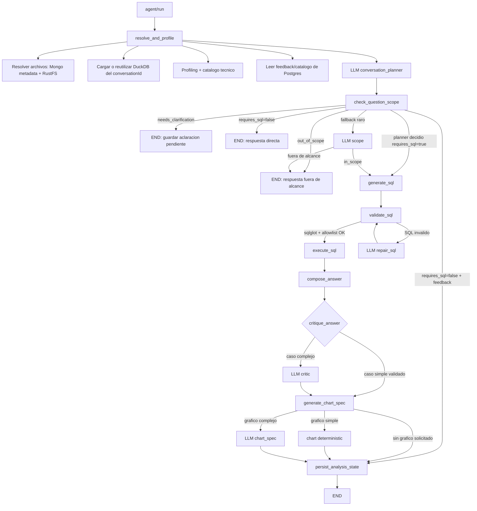

# Analitrics LangGraph

Estado actual del flujo backend del agente analítico.

## Llamadas LLM Sincronas

- Siempre: `conversation_planner`.
- SQL: `generate_sql`.
- Respuesta: `compose_answer`.
- Critica: solo casos no simples. Se salta si SQL valido en primer intento, hay filas, no hubo repair, no hay grafico y el planner tiene confianza media/alta.
- Chart spec: solo si el usuario pide grafico y no aplica el generador deterministico simple.
- Solo fallback raro: `scope`.
- Solo si SQL falla validacion: `repair_sql`.
- Desactivado por defecto en el request sincrono: extractor LLM de `analysis_state`.

## Compactacion Conservadora

- `generate_sql` recibe un contexto compacto cuando el planner no esta en baja confianza.
- Si el planner tiene baja confianza, se usa el contexto amplio.
- No se eliminan columnas por keyword matching simple.
- `compose_answer`, `critique_answer` y `chart_spec` reciben filas acotadas y SQL compacto, no el resultado completo.
- El resultado completo permanece en memoria del flujo, trazas y respuesta estructurada; solo se recorta el payload enviado al LLM.

## Validacion SQL

`sqlglot` parsea y valida estructura SQL de solo lectura. Encima se mantiene una capa propia de allowlist porque `sqlglot` no conoce que tablas pertenecen al DuckDB aislado del chat. Esa allowlist permite CTEs locales y bloquea tablas externas.
